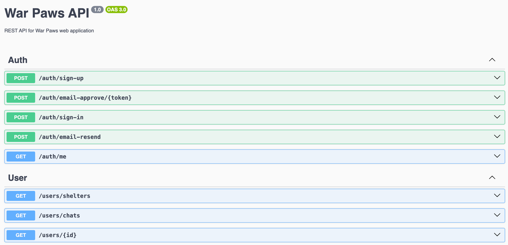

## War Paws API

An API for the War Paws web application.

## Features

- User registration and authentication (with email verification)
- User profile management
- Animal listing creation (with photos, location, description)
- Browsing and searching animal listings (by location, type, status etc.)
- Mark animal as found / taken to shelter / adopted
- Messaging system between users
- Shelter registration and management (moderated or admin-approved)
- REST & WebSocket APIs for front-end integration
- Image storage support (e.g. via AWS S3 or local file system)


## Tech details
- Multi-layered architecture with separation of concerns
- RESTful API design
- Patter repository for data access
- Mappers for data transformation
- Guards for authorization
- Global exception filter

## Tech stack
- NestJS & Express
- PrismaORM
- PostgreSQL
- Socket.io
- JWT
- Docker & Docker Compose
- Node mailer
- SMTP

## WebSocket Integration

Our project includes WebSocket support for real-time communication using socket.io. The WebSocket implementation enables users to join chat rooms, send messages, and leave rooms dynamically.

### Events

The WebSocket connection handles the following three events:

- **join** – Allows a user to join a specific chat room.

- **message** – Enables sending and receiving messages within the chat room.

- **leave** – Notifies when a user leaves a chat room.

## Installation

```bash
$ git clone https://github.com/Sikorsky-Devs/war-paws-api.git

$ cd war-paws-api
```

```bash
$ yarn install
```

## Compile and run the project

```bash
# development
$ yarn start

# watch mode
$ yarn start:dev

# production mode
$ yarn start:prod
```

## Swagger

We have Swagger for the project.



## Environment variables

```bash
DATABASE_URL=
PORT=4555

FRONT_BASE_URL=
BACK_BASE_URL=

SMTP_HOST=
SMTP_USERNAME=
SMTP_PASSWORD=

SECRET=
TTL=
```

## Deployment

First of all? we have dockerization for the project. Our Dockerfile is ready to use.

```dockerfile
FROM node:22

WORKDIR /app

COPY package*.json ./

RUN yarn install

COPY . .

RUN yarn prisma generate && \
    yarn build && \
    yarn static

EXPOSE 4555

CMD ["yarn", "start"]
```
